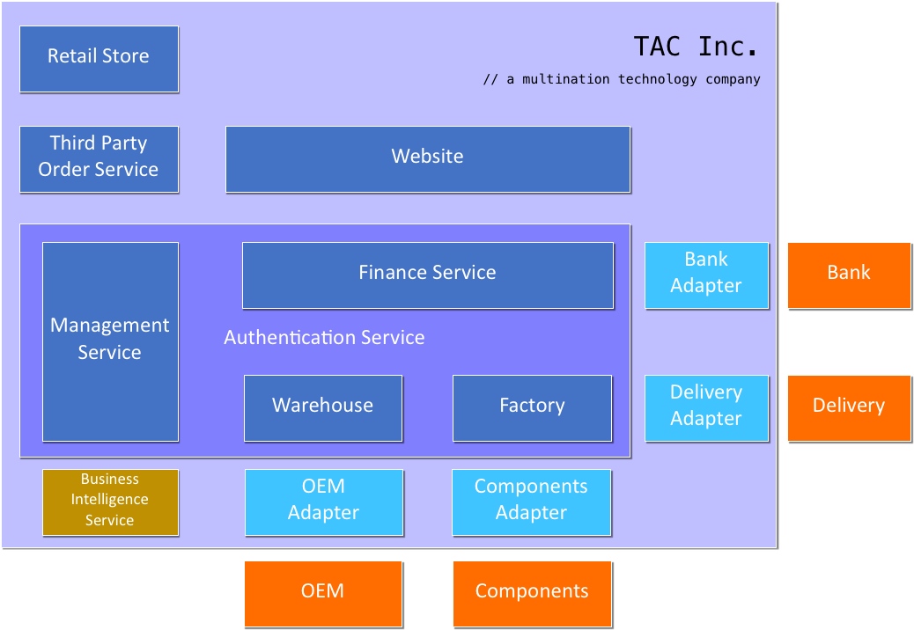
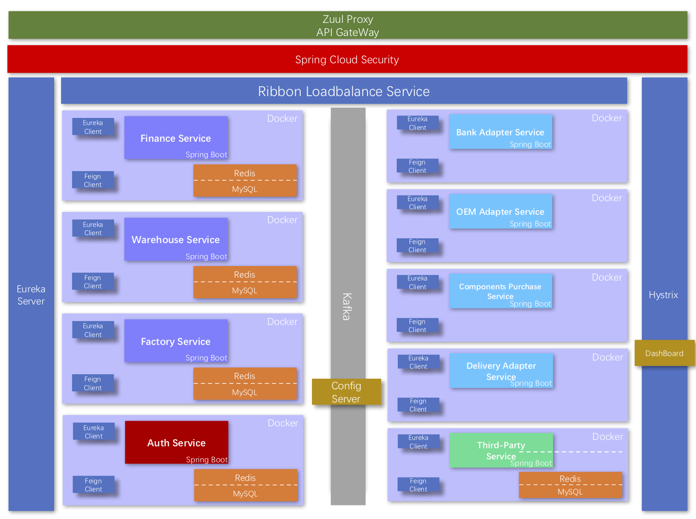
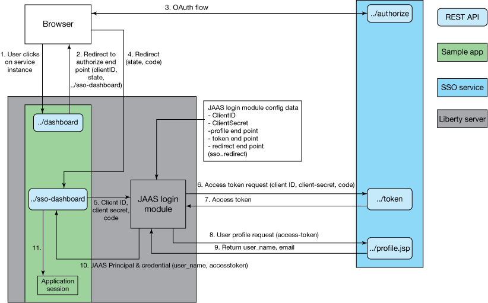

# TAC Inc.

TAC Inc. is a multinational technology company that develops and sells consumer electronics via different ways such as hte direct retail store, online store and third-party store. We also integrate the entire industrial chain vertically.

This project aims to provide a microservice system facing business based on Spring Cloud and Spring Boot.

## Functionalities

#### Authentication Service

Contains general employee login and sign up function. Thus, only be certified, can you access ``Management Service``, ``Finance Service``, ``Warehouse`` and ``Factory``.

#### Finance Service

It will call the ``Bank Adapter`` which packages some financial services, such as charge in the bank account and deposit. As a result, it will call third-party APIs from ``Bank``.

#### Warehouse

We have several warehouses all over the world. So we build a commodity dispatch system as well as a commodity management system. It provides following services:

1. Query inventory in real-time
2. Call ``delivery`` APIs to transport goods
3. Call ``OEM``(Original Equipment Manufacturer) APIs to manufacture some goods
4. Call ``Factory`` APIs to manufacture some goods

#### Factory

Our self-employed factory can produce some goods which we have the core technology. It will call third-party ``Components`` APIs to purchase some materials. Thus, it can also call ``Delivery`` APIs to transport goods.

#### Third Party Order Service

This is a service we exposed to third-party sellers like JD, Tmall and Amazon. It provides APIs to place a dealer order and estimate delivery time.

#### Website

We also have an official website, it has all our products and user can place a rerail order online. It will call ``Delivery`` to transport and call the ``Finance Service`` to cut payment.

#### Retail Store

As the Website on the Internet, Retail Store is a chain of stores sells our product in some metropolises. It will call the ``Finance Service`` to complete the payment.

#### Business Intelligence Service

This is a service which comprises the strategies and technologies used by enterprises for the data analysis of business information. Besides analyzing data on our part, it can also provide external service.

## Logical Architecture

## Development Architecture

In this Business scene, we try to design a microservice architecture.

We ignore the external interface in the figure and focus on the very backend design.

Firstly, all services we implement by ourselves provide Restful APIs and are deployed individually with their own database and data cache, by Redis.

And then, all of our services are registered in the Eureka Server. It is a service discovery and register center.

When a service's instance joins or quits the service group, Eureka Server will know and manage that automatically.

A request from outside firstly arrives the Zuul API gateway. It is just like a smart router and filter. 

Then the security component will check the Authorization and decide whether to receive or redirect it to the Authorization Service.

All request will be dispatched by a load-balanced server to every different service.

For conveniently configuring, we use a Dynamic, centralized configuration management server and a distributed messaging system to publish new configuration controlled by Git or SVN.

There is also a Circuit Breaker. It supports fault tolerance with a monitoring dashboard.

### OAuth SSO

OAuth SSO(Single Sign On System)

## Dilemma

In the project, we have met many dilemmas, including limited time, all-new framework and service. Thus, lots of micro-service and its deployment also put us in trouble. However, we all overcome them, 

## Project Schedule

| Time Point   | Schedule                                 |
| ------------ | :--------------------------------------- |
| Nov 16, 2017 | Web & SOA: Proposal submission and Proposal Presentation |
| Dec 14, 2017 | Web & SOA: Middle-term progress Presentation and Demonstration |
| Jan 2, 2018  | Java EE: Presentation and Demonstration  |
| Jan 11, 2018 | Web & SOA: Final Delivery & Presentation and Demonstration |

## Project Detail

### Docker

under ``TAC Public``, my IP Address is ``10.0.1.2``.

#### MySQL

| NAMES           | PORTS |
| --------------- | ----- |
| orders          | 3313  |
| management(CUN) | 3312  |
| bank(JIN)       | 3311  |
| components(JIN) | 3310  |
| oem(LI)         | 3309  |
| factory(LI)     | 3308  |
| warehouse(CUN)  | 3307  |
| finance(CUN)    | 3306  |

### Back-End

| NAMES         | PORTS |
| ------------- | ----- |
| intergration  | 8079  |
| oem(JSON)     | 8081  |
| oem(XML)      | 8082  |
| factory(JSON) | 8083  |
| factory(XML)  | 8084  |
| bank          | 8085  |
| components    | 8086  |

### Service Summary

1. 财务情况
   1. 获得一定时间内的收入-支出表，并显示相关的的订单
   2. 调用财务系统进行交易
2. 库存
   1. 查看库存情况
   2. 在代工厂完成订单之后，给出提示，手动入库
   3. 在原料提供商完成订单之后，给出提示，手动入库
3. 材料订单
   1. 查看近期订单
   2. 创建一个材料的订单
      1. 一个回调的接口
      2. 调用财务系统进行结算
4. 代工生产订单
   1. 查看近期订单
   2. 创建一个生产的订单
      1. 一个回调的接口
      2. 调用财务系统进行结算
5. 生产订单
   1. 查看近期订单
   2. 创建一个生产的订单
      1. 一个回调的接口
6. 物流
   1. 查看近期订单
   2. 创建一个物流的订单
      1. 一个回调的接口
7. 外部购买订单
   1. 查看近期订单
   2. 创建一个购买的订单
      1. 调用财务系统结算
      2. 调用物流发货

## Members

- 1452669 Yang LI
- 1453645 Zhongjin LUO
- 1552730 Xuantang CUN
- 1552771 Han LI