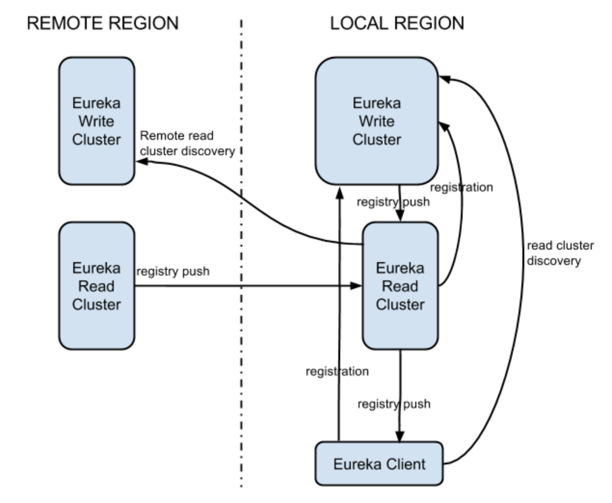
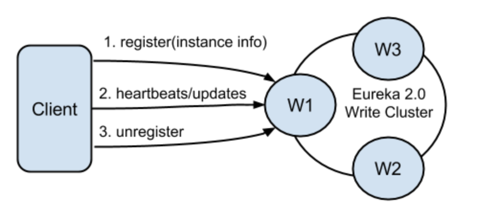
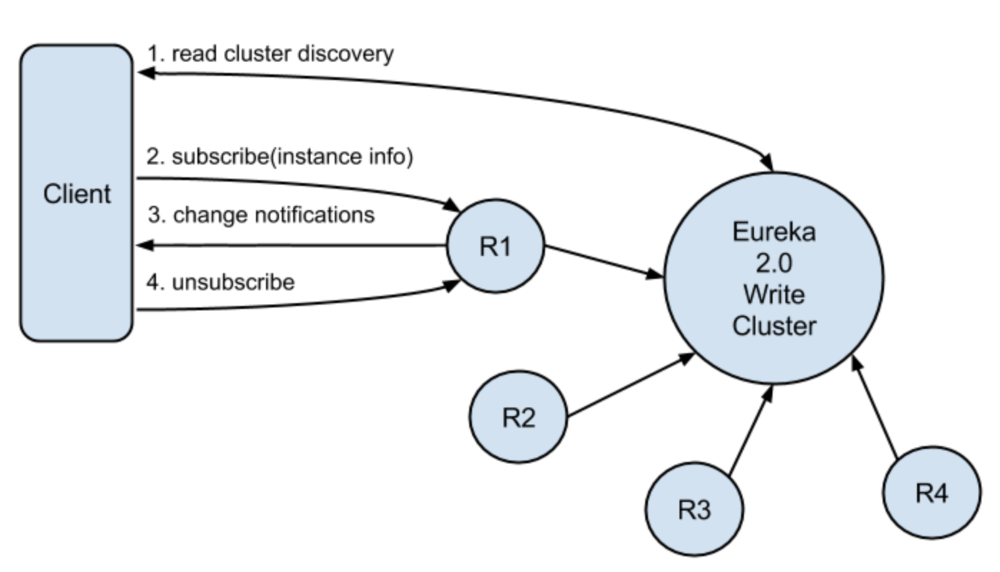
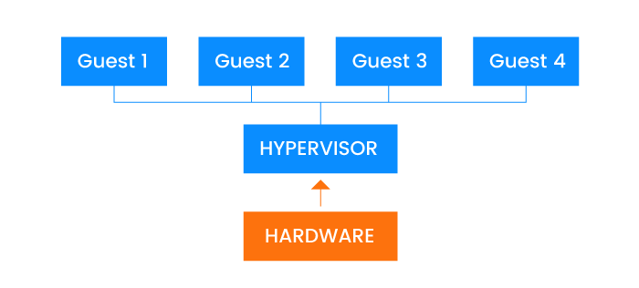

# TACUnicorn

  

TACUnicorn is a project under TAC Inc, which aims to provide a microservice system facing business based on Spring Cloud and Spring Boot.

## Requirement

- Java: 8
- Docker Engine: 17.12.0
- Docker Machine: 0.13.0
- MySQL: 14.14
- Spring Boot: 1.5.9
- Spring Cloud: Edgware
- Mybatis: 1.3.1
- Zuul: 1.2.3
- Ribbon: 2.2.4
- Eureka: 1.8.6
- RabbitMQ: 3.7.2
- Angular: 5.2.0
- Vue: 2.5.13

## Technology Stack

- Spring Boot: A framework to build a REST-based microservice, simplify the initial setup and development of Spring applications
- Spring Cloud Config: Centralized configuration server for the MSA solution
- Eureka:  Act as Service registry & discovery component
- Zuul: Edge Server, Reverse proxy server. API gateway or gate keeper for external parties
- Ribbon: Load balancer
- RabbitMQ: Messaging protocols for asynchronous communication
- Redis: Distributed caching mechanisms
- Spring Cloud OAuth2: Security mechanisms which can be integrated with microservices
- Docker: Deployment architectures for our microservices
- Angular: Front-End framework for our outside website(online store)
- Vue: Front-End framework for our inside website(background management system)

## Functionalities

### Scenario

As a integral company project, we focus on both costumer based and enterprise based aspects. Firstly, we develop an online store website to sell our product. Thus, we also provide a internal website to manage in background. By using service-oriented architecture(SOA), we develop many services inside and outside.

### Authentication Service

Contains general employee login and sign up function. Thus, only be certified, can you access ``Management Service``, ``Finance Service``, ``Warehouse`` and ``Factory``.

### Finance Service

It will call the ``Bank Adapter`` which packages some financial services, such as charge in the bank account and deposit. As a result, it will call third-party APIs from ``Bank``.

### Warehouse

We have several warehouses all over the world. So we build a commodity dispatch system as well as a commodity management system. It provides following services:

1. Query inventory in real-time
2. Call ``delivery`` APIs to transport goods
3. Call ``OEM``(Original Equipment Manufacturer) APIs to manufacture some goods
4. Call ``Factory`` APIs to manufacture some goods

### Factory

Our self-employed factory can produce some goods which we have the core technology. It will call third-party ``Components`` APIs to purchase some materials. Thus, it can also call ``Delivery`` APIs to transport goods.

#### Third Party Order Service

This is a service we exposed to third-party sellers like JD, Tmall and Amazon. It provides APIs to place a dealer order and estimate delivery time.

#### Website

We also have an official website, it has all our products and user can place a rerail order online. It will call ``Delivery`` to transport and call the ``Finance Service`` to cut payment.

#### Business Intelligence Service

This is a service which comprises the strategies and technologies used by enterprises for the data analysis of business information. Besides analyzing data on our part, it can also provide external service.

## Architecture

### Project Architecture

As you can see in [GitHub](https://github.com/TACUnicorn), we devide our work into following parts:

- [Document](https://github.com/TACUnicorn/Document): We put our all documents here for better integration and communication, such as API Document and README.
- [Management-Frontend](https://github.com/TACUnicorn/Management-Frontend): Internal background management system website.
- [OnlineStore-Frontend](https://github.com/TACUnicorn/OnlineStore-Frontend): External online sell store website.
- [AuthServer](https://github.com/TACUnicorn/AuthServer): Spring Cloud OAuth2 services.
- [Internal-Services](https://github.com/TACUnicorn/Internal-Services): All internal services.
- [External-Services](https://github.com/TACUnicorn/External-Services): All external services.
- [Adapters](https://github.com/TACUnicorn/Adapters): External services' adapters.
- [SpringCloudConfig](https://github.com/TACUnicorn/SpringCloudConfig): Centralized configuration server.

### Logical Architecture


### Development Architecture


In this Business scene, we try to design a microservice architecture.

We ignore the external interface in the figure and focus on the very backend design.

Firstly, all services we implement by ourselves provide Restful APIs and are deployed individually with their own database and data cache, by Redis.

And then, all of our services are registered in the Eureka Server. It is a service discovery and register center.

When a service's instance joins or quits the service group, Eureka Server will know and manage that automatically.

A request from outside firstly arrives the Zuul API gateway. It is just like a smart router and filter. 

Then the security component will check the Authorization and decide whether to receive or redirect it to the Authorization Service.

All request will be dispatched by a load-balanced server to every different service.

For conveniently configuring, we use a Dynamic, centralized configuration management server and a distributed messaging system to publish new configuration controlled by Git or SVN.

There is also a Circuit Breaker. It supports fault tolerance with a monitoring dashboard.

## Project Detail

### OAuth SSO

OAuth 2 is an authorization framework that enables applications to obtain limited access to user accounts on an HTTP service, such as Facebook, GitHub, and DigitalOcean. It works by delegating user authentication to the service that hosts the user account, and authorizing third-party applications to access the user account. OAuth 2 provides authorization flows for web and desktop applications, and mobile devices.


### Adapter

In service-oriented architecture, we have many external services. Actually, we have [OEM(JSON)](https://github.com/TACUnicorn/External-Services/tree/master/oem) and [OEM(XML)](https://github.com/TACUnicorn/External-Services/tree/master/oem2) services for example. To schedual and call the API, we need adapters for each services which encapsulate the API from external and provide a uniform data structure for communication.

```java
@Service
public class OrderService {
    @Autowired
    private OrderMapper orderMapper;
    public ArrayList<Order> getOrders() {
        return orderMapper.getOrders();
    }

    public void postOrder(final int materialId, final String materialName, final int materialNo, final String oem) {
        String fromAccount = "TAC Inc";
        String toAccount = oem;

        Order order = new Order();
        order.setMaterialId(materialId);
        order.setMaterialName(materialName);
        order.setMaterialNo(materialNo);
        order.setOem(oem);

        if (oem.equals("Foxconn Technology Group")) {
            order.setAmount(contactOem(materialId, materialNo, 8081));
        } else {
            order.setAmount(contactOem(materialId, materialNo, 8082));
        }

        if (transfer(fromAccount, toAccount, order.getAmount())) {
            new Thread(new Runnable() {
                @Override
                public void run() {
                    try {
                        Thread.sleep(10000);
                    } catch (InterruptedException e) {
                        e.printStackTrace();
                    }
                    putWarehouse(materialId, materialNo);
                }
            }).start();
        }
        orderMapper.add(order);
    }

    public int contactOem(int materialId, int materialNo, int oemPorts) {...}

    public void putWarehouse(int materialId, int materialNo) {...}

    public boolean transfer(String fromAccount, String toAccount, int amount) {...}

}
```

Take our OEM Adapter for in detail, from the ``POST`` request it will call different ``OEM``API, which communicate with different format data and RPC. In return, it should handle JSON and XML data separately.

### Zuul

Like we use tyk in Go before, Zuul is a JVM based router and server side load balancer by Netflix.

It provides a single entry to our system, which allows a browser, mobile app, or other user interface to consume services from multiple hosts without managing cross-origin resource sharing (CORS) and authentication for each one. We can integrate Zuul with other Netflix projects like Hystrix for fault tolerance and Eureka for service discovery, or use it to manage routing rules, filters, and load balancing across your system.

Here is the comparison:

- Microservice call without Zuul:

  

- Microservice call with Zuul:

  

- Microsrrvice call with Zuul & Eureka:

  

Here zuul.routes.producer.url will route incoming traffic to request for /producer to the employee-producer microservice. Similar routes can be added for other microservices as well.

Async systems operate differently, with generally one thread per CPU core handling all requests and responses. The lifecycle of the request and response is handled through events and callbacks. Because there is not a thread for each request, the cost of connections is cheap. This is the cost of a file descriptor, and the addition of a listener. Whereas the cost of a connection in the blocking model is a thread and with heavy memory and system overhead. There are some efficiency gains because data stays on the same CPU, making better use of CPU level caches and requiring fewer context switches. The fallout of backend latency and “retry storms” (customers and devices retrying requests when problems occur) is also less stressful on the system because connections and increased events in the queue are far less expensive than piling up threads.


The advantages of async systems sound glorious, but the above benefits come at a cost to operations. Blocking systems are easy to grok and debug. A thread is always doing a single operation so the thread’s stack is an accurate snapshot of the progress of a request or spawned task; and a thread dump can be read to follow a request spanning multiple threads by following locks. An exception thrown just pops up the stack. A “catch-all” exception handler can cleanup everything that isn’t explicitly caught.

Async, by contrast, is callback based and driven by an event loop. The event loop’s stack trace is meaningless when trying to follow a request. It is difficult to follow a request as events and callbacks are processed, and the tools to help with debugging this are sorely lacking in this area. Edge cases, unhandled exceptions, and incorrectly handled state changes create dangling resources resulting in ByteBuf leaks, file descriptor leaks, lost responses, etc. These types of issues have proven to be quite difficult to debug because it is difficult to know which event wasn’t handled properly or cleaned up appropriately.


### Eureka

Eureka is a REST (Representational State Transfer) based service that is primarily used in the AWS cloud for locating services for the purpose of load balancing and failover of middle-tier servers.

Following figure below shows the primary components in a typical Eureka 2.0 deployment. Eureka system itself consists of a write and read cluster. The write cluster is a stateful subsystem, which handles client registrations and maintains internal service registry. The registry content is replicated between the all write server nodes in an eventually consistent manner. The write cluster's registry content is read by the read cluster, that ultimately is used by the Eureka clients. As the read cluster is effectively a cache layer, it can be easily, and rapidly scaled up and down depending on the volume of the traffic. The write cluster should be pre-scaled with a capacity enough to handle the peek/busy hour traffic. Although it can be scaled up and down dynamically, it needs to be done with more coordination. Scaling up will require traffic re-balancing, which will eventually happen, but not immediately. Scaling down will force the clients from the shutdown node(s) to re-register.



#### Client Registration

Eureka clients can register themselves to be discoverable via registration, heartbeats and updates. Registrations include discoverable identifiers and service status, as well as optional freeform metadata. Eureka 2.0 servers responsible for handling these actions form the write cluster.



A single client can register multiple service instances. Each registration is handled over a separate connection to the write server, as the connection status itself denotes the service liveness. Software heartbeats at the Eureka level is used to determine connection liveness as network stacks in virtualized environments are not 100% trustworthy. If a connection is lost, the registration entry in the write cluster registry is put into the eviction queue, and ultimately remove from the registry. Well behaving clients should always send unregister request prior to disconnecting. This will result in immediate removal of the service from the registry. After the registration, the client can send any number of update requests, changing its instance data. One usage example would be modification of the service status (up/down).

#### Registry Discovery

Eureka clients can subscribe to interest sets on Eureka servers. After a successful subscription, all changes to subscribed interests are pushed by the server to the client. Eureka servers responsible for handling these actions form the read cluster.



### Ribbon

Ribbon is a Inter Process Communication (remote procedure calls) library with built in software load balancers. The primary usage model involves REST calls with various serialization scheme support.

Ribbon, as a first cut, mainly offers the client side software load balancing algorithms which have been battle tested at Netflix along with a few of the other components that form our Inter Process Communication stack (aka NIWS). We plan to continue open sourcing the rest the of the NIWS stack in the coming months. Please note that the loadbalancers mentioned are the internal client-side loadbalancers used alongside Eureka that are primarily used for load balancing requests to our mid-tier services. For our public facing Edge Services we continue to use [Amazon’s ELB Service](http://aws.amazon.com/elasticloadbalancing/).

### RabbitMQ

RabbitMQ is lightweight and easy to deploy on premises and in the cloud. It supports multiple messaging protocols. RabbitMQ can be deployed in distributed and federated configurations to meet high-scale, high-availability requirements.

A message broker can act as a middleman for various services. They can be used to reduce loads and delivery times by web application servers since tasks, which would normally take quite a bit of time to process, can be delegated to a third party whose only job is to perform them.

In this guide, we follow a scenario where a web application allows users to upload information to a website. The site will handle this information and generate a PDF and email it back to the user. Handling the information, generating the PDF and sending the email will in this example case take several seconds and that is one of the reasons of why a message queue will be used.

When the user has entered user information into the web interface, the web application will put a "PDF processing" - task and all information into a message and the message will be placed onto a queue defined in RabbitMQ.


The basic architecture of a message queue is simple, there are client applications called producers that create messages and deliver them to the broker (the message queue). Other applications, called consumers, connects to the queue and subscribes to the messages to be processed. A software can be a producer, or consumer, or both a consumer and a producer of messages. Messages placed onto the queue are stored until the consumer retrieves them.

Message queueing allows web servers to respond to requests quickly instead of being forced to perform resource-heavy procedures on the spot. Message queueing is also good when you want to distribute a message to multiple recipients for consumption or for balancing loads between workers.

Messages are not published directly to a queue, instead, the producer sends messages to an exchange. An exchange is responsible for the routing of the messages to the different queues. An exchange accepts messages from the producer application and routes them to message queues with the help of bindings and routing keys. A binding is a link between a queue and an exchange.


The figure above shows Message Flow in RabbitMQ:

1. The producer publishes a message to an exchange. When you create the exchange, you have to specify the type of it. The different types of exchanges are explained in detail later on.
2. The exchange receives the message and is now responsible for the routing of the message. The exchange takes different message attributes into account, such as routing key, depending on the exchange type.
3. Bindings have to be created from the exchange to queues. In this case, we see two bindings to two different queues from the exchange. The Exchange routes the message into the queues depending on message attributes.
4. The messages stay in the queue until they are handled by a consumer.
5. The consumer handles the message.

### Docker

Docker is the company driving the container movement and the only container platform provider to address every application across the hybrid cloud. Today’s businesses are under pressure to digitally transform but are constrained by existing applications and infrastructure while rationalizing an increasingly diverse portfolio of clouds, datacenters and application architectures. Docker enables true independence between applications and infrastructure and developers and IT ops to unlock their potential and creates a model for better collaboration and innovation.

Containerization, as an alternative to virtualization, has always had the potential to change the way we build apps. Docker, as a containerization tool, is often compared to virtual machines.

Virtual machines (VMs) were introduced to optimize the use of computing resources. You can run several VMs on a single server and deploy each application instance on a separate virtual machine. With this model, each VM provides a stable environment for a single application instance. Unfortunately, however, when we scale our application we’ll quickly encounter issues with performance, as VMs still consume a lot of resources.



The diagram above shows that hypervisor is used to run several operating systems on the same server. In the simplest terms, hypervisor helps reduce the resources required to run several operating systems.

Because microservices are similar to small apps, we must deploy microservices to their own VM instances to ensure discrete environments. And as you can imagine, dedicating an entire virtual machine to deploying only a small part of an app isn’t the most efficient option. With Docker, however, it’s possible to reduce performance overhead and deploy thousands of microservices on the same server since Docker containers require a lot fewer computing resources than virtual machines.

So far we’ve been talking about managing environments for a single app. But let’s assume you’re developing two different projects or you need to test two different versions of the same app. Conflicts between app versions or libraries (for projects) are inevitable in this case, and supporting two different environments on the same VM is a real pain.

Contrary to how VMs work, with Docker we don’t need to constantly set up clean environments in the hopes of avoiding conflicts. With Docker, we know that there will be no conflicts. Docker guarantees that application microservices will run in their own environments that are completely separate from the operating system.

Thanks to Docker, there’s no need for each developer in a team to carefully follow 20 pages of operating system-specific instructions. Instead, one developer can create a stable environment with all the necessary libraries and languages and simply save this setup in the Docker Hub (we’ll talk more about the Hub later). Other developers then only need to load the setup to have the exact same environment. As you can imagine, Docker can save us a lot of time.

If you Google you’ll likely find other benefits of using Docker, such as rapid development speed and freedom of choice in terms of technology stacks. But we’d say that these other benefits that people talk about have nothing to do with Docker itself. It’s actually the microservices-based architecture that lets you rapidly develop new features and choose any technology stack you like for each microservice.

Here is the Docker's advantages:

- Faster start time. A Docker container starts in a matter of seconds because a container is just an operating system process. A virtual machine with a complete OS can take minutes to load.
- Faster deployment. There’s no need to set up a new environment; with Docker, web development team members only need to download a Docker image to run it on a different server.
- Easier management and scaling of containers, as you can destroy and run containers faster than you can destroy and run virtual machines.
- Better usage of computing resources as you can run more containers than virtual machines on a single server.
- Support for various operating systems: you can get Docker for Windows, Mac, Debian, and other OSs.

## Document

- [API Document](https://github.com/TACUnicorn/Document/blob/master/API%20Document.md)
- Code Style: [Alibaba Java Coding Guidelines](https://alibaba.github.io/Alibaba-Java-Coding-Guidelines/)

## Schedule

| Time Point   | Schedule                                 |
| ------------ | :--------------------------------------- |
| Nov 16, 2017 | Web & SOA: Proposal submission and Proposal Presentation |
| Dec 14, 2017 | Web & SOA: Middle-term progress Presentation and Demonstration |
| Jan 2, 2018  | Java EE: Presentation and Demonstration  |
| Jan 11, 2018 | Web & SOA: Final Delivery & Presentation and Demonstration |

## Demo

Video: [YouTube](https://youtu.be/_dbgT-g96uU)

## About us

TAC Inc. is a multinational technology company that develops and sells consumer electronics via different ways such as direct retail store, online store and third-party store. We also intergrate the entire industrial chain vertically.

**Board Of Directors**(Contributers)

- 1452669 [Yang LI](https://github.com/zjzsliyang)
- 1453645 [Zhongjin LUO](https://github.com/tjluozhongjin)
- 1552730 [Xuantang CUN](https://github.com/wzes)
- 1552771 [Han LI](https://github.com/lisirrx)

## License

[MIT License](https://github.com/TACUnicorn/Document/blob/master/LICENSE)

Copyright (c) 2018 TAC Inc.