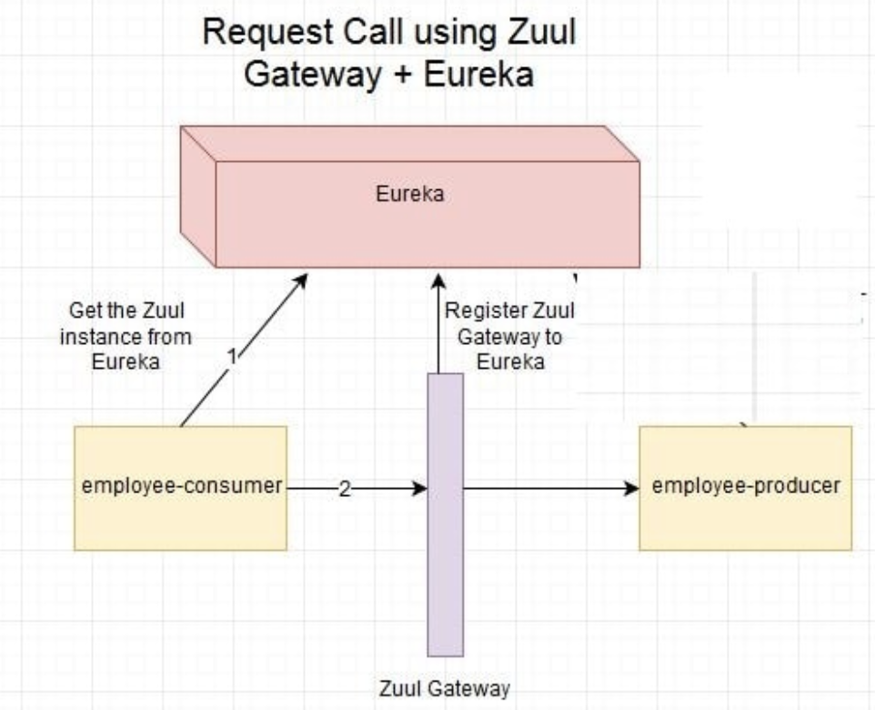

# TACUnicorn

 

TACUnicorn is a project under TAC Inc, which aims to provide a microservice system facing business based on Spring Cloud and Spring Boot.

## Requirement

- Java: 8
- Docker Engine: 17.12.0
- Docker Machine: 0.13.0
- MySQL: 14.14
- Spring Boot: 1.5.9
- Spring Cloud: Edgware
- Mybatis: 1.3.1
- Zuul: 1.2.3
- Ribbon: 2.2.4
- Eureka: 1.8.6
- RabbitMQ: 3.7.2
- Angular: 5.2.0
- Vue: 2.5.13

## Technology Stack

- Spring Boot: A framework to build a REST-based microservice, simplify the initial setup and development of Spring applications
- Spring Cloud Config: Centralized configuration server for the MSA solution
- Eureka:  Act as Service registry & discovery component
- Zuul: Edge Server, Reverse proxy server. API gateway or gate keeper for external parties
- Ribbon: Load balancer
- RabbitMQ: Messaging protocols for asynchronous communication
- Redis: Distributed caching mechanisms
- Spring Cloud OAuth2: Security mechanisms which can be integrated with microservices
- Docker: Deployment architectures for our microservices
- Angular: Front-End framework for our outside website(online store)
- Vue: Front-End framework for our inside website(background management system)

## Functionalities

### Scenario

As a integral company project, we focus on both costumer based and enterprise based aspects. Firstly, we develop an online store website to sell our product. Thus, we also provide a internal website to manage in background. By using service-oriented architecture(SOA), we develop many services inside and outside.

### Authentication Service

Contains general employee login and sign up function. Thus, only be certified, can you access ``Management Service``, ``Finance Service``, ``Warehouse`` and ``Factory``.

### Finance Service

It will call the ``Bank Adapter`` which packages some financial services, such as charge in the bank account and deposit. As a result, it will call third-party APIs from ``Bank``.

### Warehouse

We have several warehouses all over the world. So we build a commodity dispatch system as well as a commodity management system. It provides following services:

1. Query inventory in real-time
2. Call ``delivery`` APIs to transport goods
3. Call ``OEM``(Original Equipment Manufacturer) APIs to manufacture some goods
4. Call ``Factory`` APIs to manufacture some goods

### Factory

Our self-employed factory can produce some goods which we have the core technology. It will call third-party ``Components`` APIs to purchase some materials. Thus, it can also call ``Delivery`` APIs to transport goods.

#### Third Party Order Service

This is a service we exposed to third-party sellers like JD, Tmall and Amazon. It provides APIs to place a dealer order and estimate delivery time.

#### Website

We also have an official website, it has all our products and user can place a rerail order online. It will call ``Delivery`` to transport and call the ``Finance Service`` to cut payment.

#### Business Intelligence Service

This is a service which comprises the strategies and technologies used by enterprises for the data analysis of business information. Besides analyzing data on our part, it can also provide external service.

## Architecture

### Project Architecture

As you can see in [GitHub](https://github.com/TACUnicorn), we devide our work into following parts:

- [Document](https://github.com/TACUnicorn/Document): We put our all documents here for better integration and communication, such as API Document and README.
- [Management-Frontend](https://github.com/TACUnicorn/Management-Frontend): Internal background management system website.
- [OnlineStore-Frontend](https://github.com/TACUnicorn/OnlineStore-Frontend): External online sell store website.
- [AuthServer](https://github.com/TACUnicorn/AuthServer): Spring Cloud OAuth2 services.
- [Internal-Services](https://github.com/TACUnicorn/Internal-Services): All internal services.
- [External-Services](https://github.com/TACUnicorn/External-Services): All external services.
- [Adapters](https://github.com/TACUnicorn/Adapters): External services' adapters.
- [SpringCloudConfig](https://github.com/TACUnicorn/SpringCloudConfig): Centralized configuration server.

### Logical Architecture


### Development Architecture


In this Business scene, we try to design a microservice architecture.

We ignore the external interface in the figure and focus on the very backend design.

Firstly, all services we implement by ourselves provide Restful APIs and are deployed individually with their own database and data cache, by Redis.

And then, all of our services are registered in the Eureka Server. It is a service discovery and register center.

When a service's instance joins or quits the service group, Eureka Server will know and manage that automatically.

A request from outside firstly arrives the Zuul API gateway. It is just like a smart router and filter. 

Then the security component will check the Authorization and decide whether to receive or redirect it to the Authorization Service.

All request will be dispatched by a load-balanced server to every different service.

For conveniently configuring, we use a Dynamic, centralized configuration management server and a distributed messaging system to publish new configuration controlled by Git or SVN.

There is also a Circuit Breaker. It supports fault tolerance with a monitoring dashboard.

## Project Detail

### OAuth SSO

OAuth 2 is an authorization framework that enables applications to obtain limited access to user accounts on an HTTP service, such as Facebook, GitHub, and DigitalOcean. It works by delegating user authentication to the service that hosts the user account, and authorizing third-party applications to access the user account. OAuth 2 provides authorization flows for web and desktop applications, and mobile devices.


### Adapter

In service-oriented architecture, we have many external services. Actually, we have [OEM(JSON)](https://github.com/TACUnicorn/External-Services/tree/master/oem) and [OEM(XML)](https://github.com/TACUnicorn/External-Services/tree/master/oem2) services for example. To schedual and call the API, we need adapters for each services which encapsulate the API from external and provide a uniform data structure for communication.

```java
@Service
public class OrderService {
    @Autowired
    private OrderMapper orderMapper;
    public ArrayList<Order> getOrders() {
        return orderMapper.getOrders();
    }

    public void postOrder(final int materialId, final String materialName, final int materialNo, final String oem) {
        String fromAccount = "TAC Inc";
        String toAccount = oem;

        Order order = new Order();
        order.setMaterialId(materialId);
        order.setMaterialName(materialName);
        order.setMaterialNo(materialNo);
        order.setOem(oem);

        if (oem.equals("Foxconn Technology Group")) {
            order.setAmount(contactOem(materialId, materialNo, 8081));
        } else {
            order.setAmount(contactOem(materialId, materialNo, 8082));
        }

        if (transfer(fromAccount, toAccount, order.getAmount())) {
            new Thread(new Runnable() {
                @Override
                public void run() {
                    try {
                        Thread.sleep(10000);
                    } catch (InterruptedException e) {
                        e.printStackTrace();
                    }
                    putWarehouse(materialId, materialNo);
                }
            }).start();
        }
        orderMapper.add(order);
    }

    public int contactOem(int materialId, int materialNo, int oemPorts) {...}

    public void putWarehouse(int materialId, int materialNo) {...}

    public boolean transfer(String fromAccount, String toAccount, int amount) {...}

}
```

Take our OEM Adapter for in detail, from the ``POST`` request it will call different ``OEM``API, which communicate with different format data and RPC. In return, it should handle JSON and XML data separately.

### Zuul

Like we use tyk in Go before, Zuul is a JVM based router and server side load balancer by Netflix.

It provides a single entry to our system, which allows a browser, mobile app, or other user interface to consume services from multiple hosts without managing cross-origin resource sharing (CORS) and authentication for each one. We can integrate Zuul with other Netflix projects like Hystrix for fault tolerance and Eureka for service discovery, or use it to manage routing rules, filters, and load balancing across your system.

Here is the comparison:

- Microservice call without Zuul:

  

- Microservice call with Zuul:

  

- Microsrrvice call with Zuul & Eureka:

  

Here zuul.routes.producer.url will route incoming traffic to request for /producer to the employee-producer microservice. Similar routes can be added for other microservices as well.

Async systems operate differently, with generally one thread per CPU core handling all requests and responses. The lifecycle of the request and response is handled through events and callbacks. Because there is not a thread for each request, the cost of connections is cheap. This is the cost of a file descriptor, and the addition of a listener. Whereas the cost of a connection in the blocking model is a thread and with heavy memory and system overhead. There are some efficiency gains because data stays on the same CPU, making better use of CPU level caches and requiring fewer context switches. The fallout of backend latency and “retry storms” (customers and devices retrying requests when problems occur) is also less stressful on the system because connections and increased events in the queue are far less expensive than piling up threads.


The advantages of async systems sound glorious, but the above benefits come at a cost to operations. Blocking systems are easy to grok and debug. A thread is always doing a single operation so the thread’s stack is an accurate snapshot of the progress of a request or spawned task; and a thread dump can be read to follow a request spanning multiple threads by following locks. An exception thrown just pops up the stack. A “catch-all” exception handler can cleanup everything that isn’t explicitly caught.

Async, by contrast, is callback based and driven by an event loop. The event loop’s stack trace is meaningless when trying to follow a request. It is difficult to follow a request as events and callbacks are processed, and the tools to help with debugging this are sorely lacking in this area. Edge cases, unhandled exceptions, and incorrectly handled state changes create dangling resources resulting in ByteBuf leaks, file descriptor leaks, lost responses, etc. These types of issues have proven to be quite difficult to debug because it is difficult to know which event wasn’t handled properly or cleaned up appropriately.


### Eureka


### Ribbon


### RabbitMQ


### Docker


## Document

- API Document
- Code Style: [Alibaba Java Coding Guidelines](https://alibaba.github.io/Alibaba-Java-Coding-Guidelines/)

## Schedule

| Time Point   | Schedule                                 |
| ------------ | :--------------------------------------- |
| Nov 16, 2017 | Web & SOA: Proposal submission and Proposal Presentation |
| Dec 14, 2017 | Web & SOA: Middle-term progress Presentation and Demonstration |
| Jan 2, 2018  | Java EE: Presentation and Demonstration  |
| Jan 11, 2018 | Web & SOA: Final Delivery & Presentation and Demonstration |

## Demo

Video: [YouTube](https://youtu.be/_dbgT-g96uU)

## About us

TAC Inc. is a multinational technology company that develops and sells consumer electronics via different ways such as direct retail store, online store and third-party store. We also intergrate the entire industrial chain vertically.

**Board Of Directors**(Contributers)

- 1452669 [Yang LI](https://github.com/zjzsliyang)
- 1453645 [Zhongjin LUO](https://github.com/tjluozhongjin)
- 1552730 [Xuantang CUN](https://github.com/wzes)
- 1552771 [Han LI](https://github.com/lisirrx)

## License

[MIT License](https://github.com/TACUnicorn/Document/blob/master/LICENSE)

Copyright (c) 2018 TAC Inc.